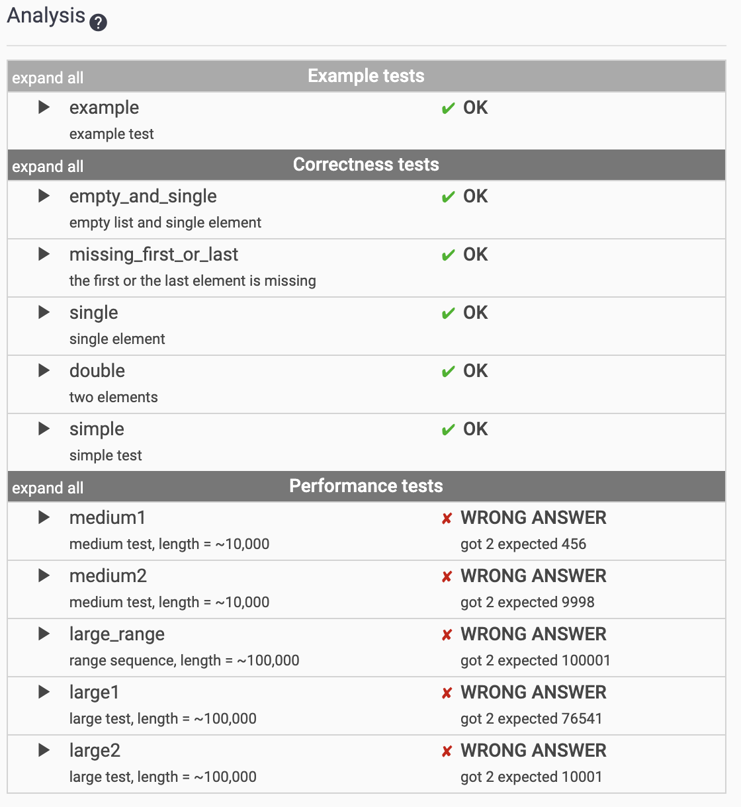
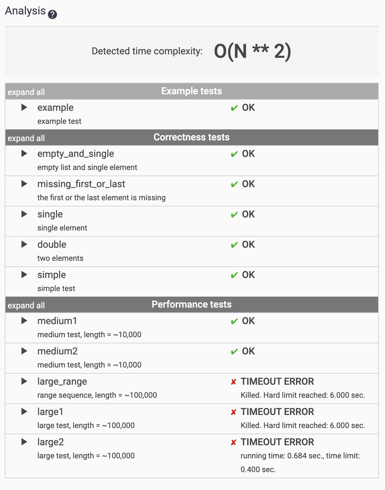
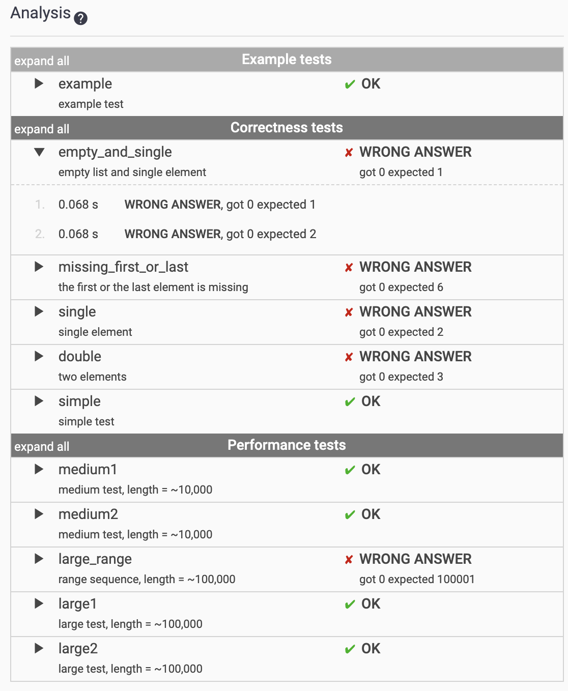
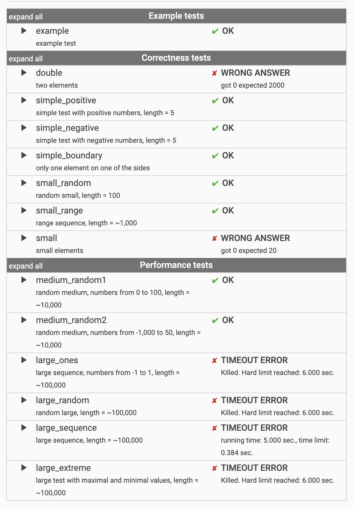

# 놓친부분
- Math.ceil
- Array.prototype.filter
- Array.prototype.map
- Array.prototype.some
  > some()은 조건이 true가 되는 순간 break;
- Array.prototype.every
- Array.prototype.fill
- Math.abs
---
### TODO list
- [PermMissingElem]
   - 100점 만들기  결과: 
    
    
    
- [TapeEquilibrium]
   - 100점 만들기  결과: 
    
---
### 참고 URL
- 배열에서 최소값 갖고 오기
  Math.min(...Array)
  > https://medium.com/@vladbezden/how-to-get-min-or-max-of-an-array-in-javascript-1c264ec6e1aa